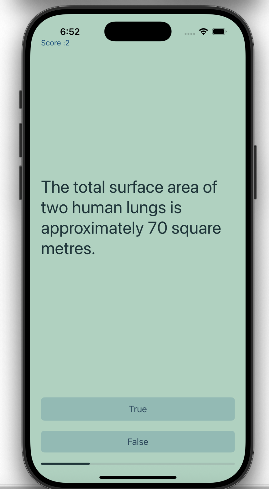

# 🧠 Quizlet - iOS Quiz App

A simple and interactive quiz application built using Swift and UIKit. Users can test their knowledge by answering true/false questions and track their progress through a visual progress bar and score label.
 
## 📱 Features

- Answer True/False questions
- Visual progress tracking with a `UIProgressView`
- Score tracking and update
- Modular structure using MVC (Model-View-Controller) pattern

## 🛠️ Built With

- **Language**: Swift
- **Framework**: UIKit
- **Design Pattern**: MVC
- **IDE**: Xcode

## 🚀 Getting Started

### Prerequisites

- macOS with Xcode installed (13+ recommended)
- iOS Simulator or physical iPhone

## Preview 
 

   
